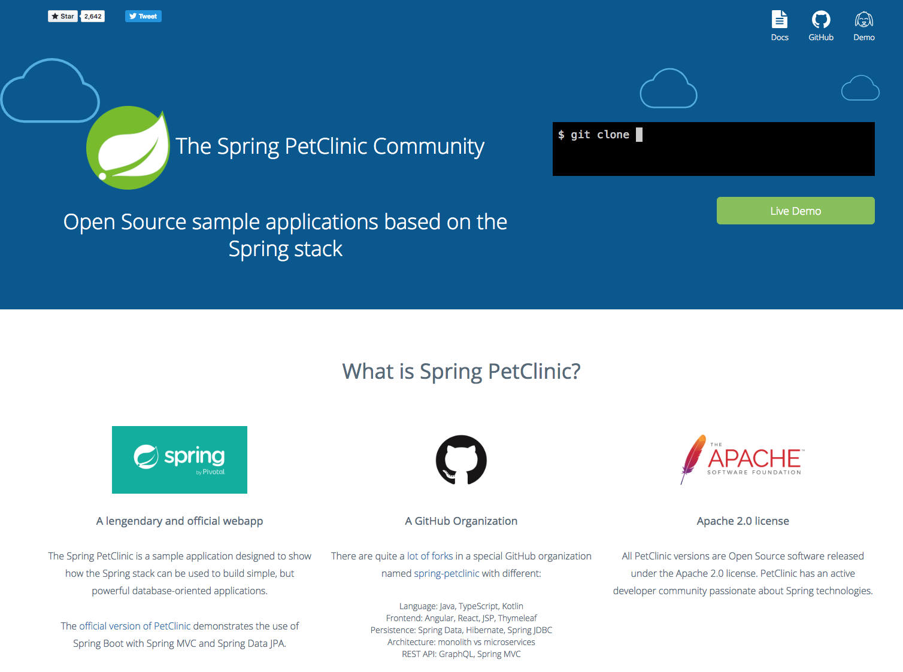

The Spring PetClinic Community web site
=======================================

This GitHub repository contains the Jekyll website of the Spring PetClinic community.
It is published at [spring-petclinic.github.io](https://spring-petclinic.github.io)

# Content

## Home

The homepage is `index.html` in the root.

## Docs

Docs live in `/docs` directory.

## Data

The `/data` directory contains recorded terminal session for asciinema.


# Contribute

## Jekyll installation

See the GitHub documentation: [Setting up your GitHub Pages site locally with Jekyll](https://help.github.com/articles/setting-up-your-github-pages-site-locally-with-jekyll/)

## Usage

```
# install dependencies
bundle install

# build Jekyll site
bundle exec jekyll build

# run your Jekyll site locally
bundle exec jekyll serve
```

Preview the local Jekyll site in your web browser at http://localhost:4000.


## Publish

Simply commit your changes and do a git push.


# Website preview

